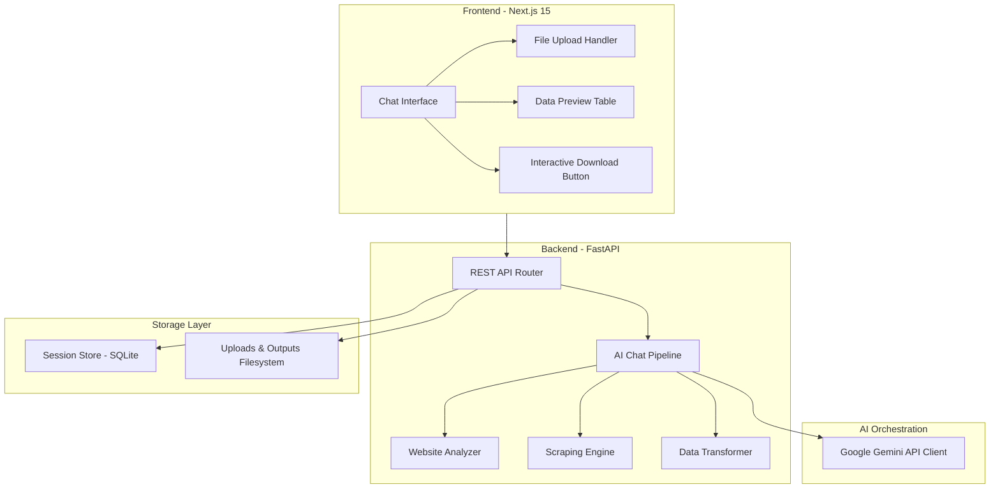

# 🤖 AI Scraper Engine

An intelligent, conversational web scraping platform that builds, plans, and executes data extraction pipelines using natural language instructions. Powered by **FastAPI (Python)**, **Next.js 15 (React)**, and **Google Gemini AI**.

---

## 🌟 Features

*   **💬 Conversational Chat Interface**: Simply describe what data you want to extract and from which website. No coding or complex selector configuration required.
*   **🧠 Multi-Agent AI Pipeline**:
    1.  **Intent Understanding**: Understands user prompt, requested fields, and target format.
    2.  **Website Reconnaissance**: Performs automated analysis on target URL to detect static/dynamic content, discover hidden APIs, identify security measures, and read `robots.txt`.
    3.  **Strategy Planning**: Generates optimized CSS selectors and chooses the best scraping technique.
    4.  **Resilient Execution**: Scrapes via direct HTTP, Playwright stealth browser automation, or API endpoints.
    5.  **Data Transformation**: Cleans, deduplicates, and structures raw data.
    6.  **AI Quality Validation**: Evaluates data quality and issues a validation score out of 100 before export.
*   **🔄 Real-time Streaming**: Real-time progress updates streamed to the UI using Server-Sent Events (SSE).
*   **🛡️ Robust API Resilience**: central AI service with exponential backoff and cascading model fallback (tries `gemini-2.5-flash` → `gemini-2.0-flash` → `gemini-2.0-flash-lite` → `gemini-1.5-flash`) on transient errors (503/429/overloaded).
*   **📥 Visual Download Center**: Clickable download card directly inside the chat feed to export final results to **CSV, XLSX, JSON, or XML** formats.

---

## 🏗️ System Architecture



---

## 🚀 Getting Started

### Prerequisites
*   [Node.js (v18.0.0+)](https://nodejs.org/) & `npm`
*   [Python (v3.10+)](https://www.python.org/)
*   Gemini API Key from [Google AI Studio](https://aistudio.google.com/)

---

### 1. Backend Setup

1.  Navigate to the backend directory:
    ```bash
    cd backend
    ```
2.  Create a virtual environment and activate it:
    ```bash
    # Windows
    python -m venv .venv
    .venv\Scripts\activate

    # macOS/Linux
    python3 -m venv .venv
    source .venv/bin/activate
    ```
3.  Install dependencies:
    ```bash
    pip install -r requirements.txt
    ```
4.  Install the required Playwright browsers:
    ```bash
    playwright install chromium
    ```
5.  Create a `.env` file inside the `backend/` directory:
    ```env
    GEMINI_API_KEY=your_actual_gemini_api_key_here
    GEMINI_MODEL=gemini-2.5-flash
    GEMINI_FALLBACK_MODELS=gemini-2.0-flash,gemini-2.0-flash-lite,gemini-1.5-flash
    AI_MAX_RETRIES=3
    AI_RETRY_BASE_DELAY=2.0
    ```
6.  Start the FastAPI server:
    ```bash
    python main.py
    ```
    *The API will start running on:* `http://localhost:8000`

---

### 2. Frontend Setup

1.  Navigate to the frontend directory:
    ```bash
    cd frontend
    ```
2.  Install packages:
    ```bash
    npm install
    ```
3.  Start the Next.js development server:
    ```bash
    npm run dev
    ```
    *The client will start running on:* `http://localhost:3000`

---

## 🛠️ Tech Stack

### Frontend
*   **Framework**: Next.js 15 (App Router, Server Actions)
*   **Language**: TypeScript
*   **Styling**: Pure CSS (Dark Mode, Glassmorphism, Micro-animations)
*   **API Client**: Native `fetch` with Server-Sent Events (SSE) stream decoder

### Backend
*   **Framework**: FastAPI
*   **ORM**: SQLAlchemy & `aiosqlite` (Async SQLite driver)
*   **AI SDK**: `google-genai` (Official Google GenAI Python Client)
*   **Scraping Toolchain**: `playwright`, `beautifulsoup4`, `httpx`
*   **Data Processing**: `pandas` & `openpyxl` (XLSX export)

---

## 📈 Detailed Scraping Workflow

```
[User Message] 
      │
      ▼
1. AI Understanding (Gemini)
   ├── Extracted URLs, Target Fields, Formats
   └── Match columns if user uploaded a template file
      │
      ▼
2. Website Reconnaissance (WebsiteAnalyzer)
   ├── Fetches page and strips heavy elements (CSS, scripts, SVGs)
   ├── Checks for dynamic loading, REST/GraphQL APIs, and robots.txt
   └── Generates dense HTML sample for strategy phase
      │
      ▼
3. Strategy & Selector Generation (Gemini)
   ├── Analyzes the dense HTML body structure
   ├── Recommends: direct_http (fast), browser_automation (stealth), or api_integration
   └── Generates optimized class and layout CSS selectors
      │
      ▼
4. Scraping Execution (ScrapingEngine)
   ├── Runs selected technique with automated delay jitter
   └── Streams real-time progress steps and metrics via SSE
      │
      ▼
5. Transform & AI Quality Validation (DataTransformer / Gemini)
   ├── Formats DataFrame, drops duplicates, cleans strings
   └── AI runs validation check on sample records, producing a Quality Score
      │
      ▼
6. Interactive Chat Preview & Approve
   ├── User previews structured tables & score in chat feed
   └── Approves and clicks persistent "📥 Download File" card
```

---

## 🛡️ License

This project is open-source. Feel free to modify and build upon it!
