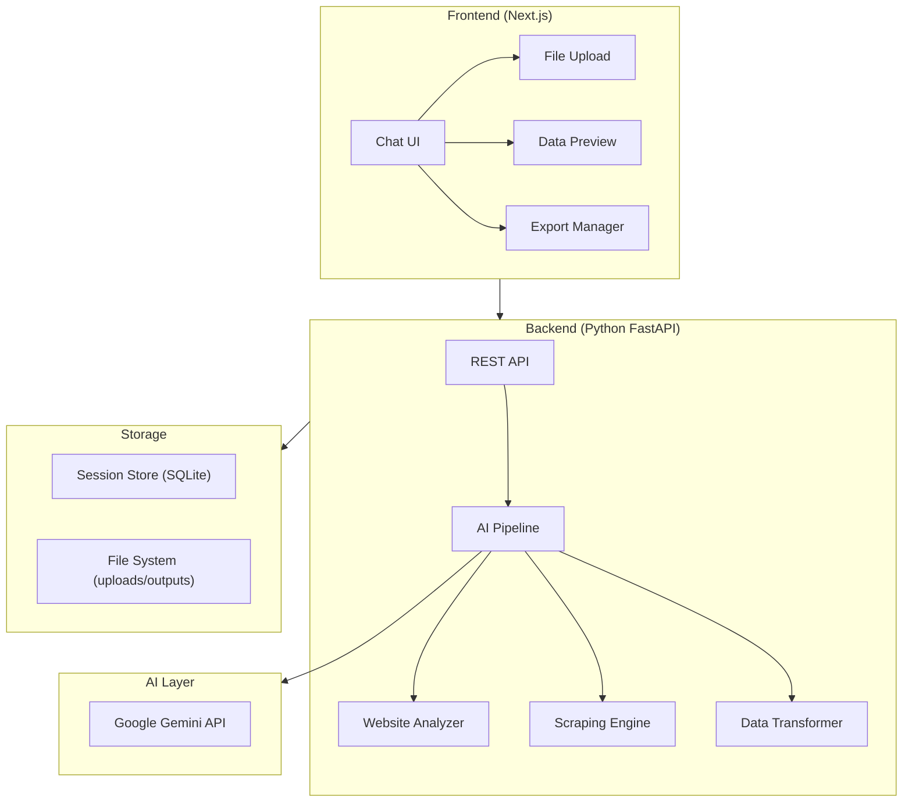
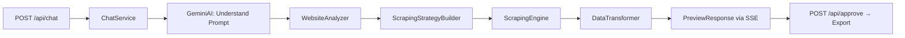

# AI Scraper Engine — Implementation Plan

An AI-powered web scraping chatbot that takes user instructions in natural language, analyzes target websites, builds scraping strategies, and delivers clean structured data — all through a conversational UI.

---

## High-Level Architecture



---

## Tech Stack

| Layer | Technology | Rationale |
|---|---|---|
| **Frontend** | Next.js 15 (App Router) + TypeScript | Modern React framework with SSR, great DX |
| **Styling** | Vanilla CSS with CSS variables | Maximum control for premium design |
| **Backend** | Python 3.12 + FastAPI | Best ecosystem for scraping (BeautifulSoup, Playwright, requests) |
| **AI** | Google Gemini API (gemini-2.5-flash) | Excellent for instruction following, code gen, structured output |
| **Scraping** | Playwright + BeautifulSoup4 + httpx | Covers both static & dynamic sites |
| **Database** | SQLite (via SQLAlchemy) | Lightweight, zero-config, sufficient for session/chat persistence |
| **File Handling** | pandas + openpyxl | Robust XLSX/CSV/JSON/XML read/write |
| **Communication** | REST + Server-Sent Events (SSE) | SSE for real-time pipeline progress streaming |

---

## User Review Required

> [!IMPORTANT]
> **AI API Key**: The system will use Google Gemini API. You'll need to provide a `GEMINI_API_KEY` environment variable. Do you have one, or should we add a UI field for users to input their own key?

> [!IMPORTANT]
> **Authentication**: The current plan has NO user authentication (single-user local tool). Should we add multi-user auth (e.g., Google OAuth)?

> [!WARNING]
> **Anti-Scraping Bypass**: Some techniques in the README (CAPTCHA solving, fingerprint spoofing) border on ToS violations for many sites. The tool will implement ethical scraping with proper headers, rate limiting, and robots.txt respect. Aggressive bypass techniques will be available as opt-in flags with disclaimers.

---

## Open Questions

> [!IMPORTANT]
> 1. Should this be a **locally-run tool** (user runs it on their machine) or a **deployed web app** (hosted somewhere)?
> 2. Do you want **concurrent scraping** support (multiple scraping jobs at once)?
> 3. For the Gemini API, do you have a preferred model (e.g., `gemini-2.5-flash` vs `gemini-2.5-pro`)?
> 4. Should chat history persist across browser sessions (database-backed) or be ephemeral (in-memory only)?

---

## Proposed Changes

### 1. Frontend — Next.js Chat Application

The UI is a **modern chatbot interface** with a dark-mode-first design featuring glassmorphism, smooth animations, and a sidebar for session management.

#### Key UI Sections

```
┌─────────────────────────────────────────────────────┐
│  ┌──────────┐  ┌──────────────────────────────────┐ │
│  │ SIDEBAR  │  │  CHAT AREA                       │ │
│  │          │  │                                  │ │
│  │ + New    │  │  [AI] Welcome! Upload your file  │ │
│  │ Chat     │  │       and tell me what data you  │ │
│  │          │  │       need.                      │ │
│  │ ─────── │  │                                  │ │
│  │ Session1 │  │  [User] I need emails from...    │ │
│  │ Session2 │  │                                  │ │
│  │ Session3 │  │  [AI] Analyzing website...       │ │
│  │          │  │  ┌─ Pipeline Progress ──────┐    │ │
│  │          │  │  │ ✓ URL Validated          │    │ │
│  │          │  │  │ ✓ Site Analyzed          │    │ │
│  │          │  │  │ ● Scraping (43/100)...   │    │ │
│  │          │  │  │ ○ Transform Data         │    │ │
│  │          │  │  └──────────────────────────┘    │ │
│  │          │  │                                  │ │
│  │          │  │  [AI] Here's a preview:          │ │
│  │          │  │  ┌─ Data Preview Table ─────┐    │ │
│  │          │  │  │ Name │ Email │ Phone     │    │ │
│  │          │  │  │ ... │ ...  │ ...       │    │ │
│  │          │  │  └──────────────────────────┘    │ │
│  │          │  │  [Approve ✓] [Retry ↻] [Edit ✏] │ │
│  │          │  │                                  │ │
│  │          │  ├──────────────────────────────────┤ │
│  │          │  │ [📎 Upload] [Type message...] [→]│ │
│  └──────────┘  └──────────────────────────────────┘ │
└─────────────────────────────────────────────────────┘
```

#### [NEW] `frontend/` directory

All frontend code lives here, bootstrapped with `create-next-app`.

##### Key files:

| File | Purpose |
|---|---|
| `app/layout.tsx` | Root layout with fonts (Inter), metadata, global CSS |
| `app/page.tsx` | Main chat page |
| `app/globals.css` | Design system — CSS variables, animations, glassmorphism |
| `components/Chat/ChatArea.tsx` | Message list, auto-scroll, message bubbles |
| `components/Chat/MessageInput.tsx` | Input bar with file upload, send button |
| `components/Chat/MessageBubble.tsx` | Individual message (user/AI) with markdown support |
| `components/Chat/PipelineProgress.tsx` | Real-time scraping pipeline status stepper |
| `components/Chat/DataPreview.tsx` | Tabular data preview with approve/reject/edit actions |
| `components/Sidebar/Sidebar.tsx` | Session list, new chat button |
| `components/FileUpload/FileUpload.tsx` | Drag-and-drop file upload with format validation |
| `lib/api.ts` | API client functions for backend communication |
| `lib/types.ts` | TypeScript type definitions |

---

### 2. Backend — Python FastAPI Service

The backend is a **Python FastAPI** application that orchestrates the entire AI scraping pipeline.

#### [NEW] `backend/` directory

##### Core Architecture:



##### Key files:

| File | Purpose |
|---|---|
| `main.py` | FastAPI app, CORS, startup/shutdown |
| `routers/chat.py` | Chat endpoints: send message, get history, SSE stream |
| `routers/sessions.py` | Session CRUD: create, list, delete |
| `routers/files.py` | File upload/download endpoints |
| `services/chat_service.py` | Orchestrates the full pipeline per user message |
| `services/ai_service.py` | Gemini API integration — prompt understanding, strategy planning |
| `services/website_analyzer.py` | Visits URL, detects static/dynamic content, checks for APIs, anti-scraping |
| `services/scraping_engine.py` | Executes scraping using Playwright/httpx/BeautifulSoup |
| `services/data_transformer.py` | Converts raw scraped data → user's desired output format |
| `services/session_store.py` | SQLite-backed chat/session persistence |
| `models/schemas.py` | Pydantic models for request/response validation |
| `models/database.py` | SQLAlchemy models and DB setup |
| `utils/file_handler.py` | Read/write XLSX, CSV, JSON, XML files |
| `utils/anti_detection.py` | Rotating user-agents, proxy support, rate limiting |
| `config.py` | Environment variables, settings |
| `requirements.txt` | Python dependencies |

---

### 3. AI Pipeline — The Core Logic

This is the heart of the system. Each user message flows through these stages:

#### Stage 1: Prompt Understanding
- Gemini analyzes the user's natural language request
- Extracts: **target URL**, **desired fields**, **input file context**, **output format**
- If information is missing, AI asks follow-up questions

#### Stage 2: Input File Analysis
- If user uploaded a file (CSV/XLSX/JSON/XML), parse it
- Understand the schema, sample data, and what columns map to scraping targets
- E.g., "Here's a list of company names → scrape their websites for email addresses"

#### Stage 3: Website Reconnaissance (from [README.md](file:///d:/Harsh/Community/AI-Scraper-Engine/README.md))
Following the checklist from the README, plus additional practical steps:

1. **Visit the website** — Load with Playwright, capture HTML
2. **Static vs Dynamic detection** — Check if content loads via JS
3. **API Discovery** — Inspect network requests for REST/GraphQL APIs
4. **API Analysis** (if found):
   - Authentication mechanism (API key, OAuth, session)
   - Rate limiting headers
   - Request/response formats
   - Required headers, cookies, payloads
5. **Anti-scraping detection**:
   - CAPTCHA presence (reCAPTCHA, hCaptcha)
   - Rate limiting behavior
   - User-Agent validation
   - Cookie/session requirements
   - **[Added]** robots.txt and sitemap.xml analysis
   - **[Added]** JavaScript challenge detection (Cloudflare, Akamai)
   - **[Added]** Pagination pattern detection
6. **Technique selection**:
   - Direct HTTP (fastest, for static sites with no protection)
   - Browser automation via Playwright (for JS-heavy/protected sites)
   - API integration (if clean API discovered)
7. **[Added]** **Selector generation** — AI generates CSS/XPath selectors for target data
8. **[Added]** **Pagination strategy** — Detect and plan for multi-page scraping

#### Stage 4: Scraping Execution
- Execute the chosen strategy with real-time progress via SSE
- Handle retries, rate limiting, and errors gracefully
- Stream progress updates: "Scraped 43/100 pages..."

#### Stage 5: Data Transformation
- Convert raw scraped data to user's requested format
- Apply any transformations (filtering, deduplication, formatting)
- Gemini validates output matches user's requirements

#### Stage 6: Preview & Approval
- Show the user a preview table (first 20 rows)
- User can: **Approve** (save final output), **Retry** (re-scrape), or **Edit** (modify instructions)

#### Stage 7: Export
- Save to user's chosen format (CSV/XLSX/JSON/XML)
- Provide download link

---

### 4. Session & Knowledge Management

Each chat session maintains context:

```
Session {
  id: uuid
  title: string (auto-generated from first message)
  messages: Message[]
  context: {
    target_url: string
    input_file: FileMetadata
    desired_output: OutputSpec
    scraping_strategy: StrategyPlan
    scraped_data: DataPreview
    approved: boolean
  }
  created_at: datetime
  updated_at: datetime
}
```

This ensures the AI remembers what the user wants across multiple messages in the same session.

---

## Project Structure

```
AI-Scraper-Engine/
├── README.md
├── frontend/                    # Next.js application
│   ├── package.json
│   ├── next.config.ts
│   ├── tsconfig.json
│   ├── app/
│   │   ├── layout.tsx
│   │   ├── page.tsx
│   │   └── globals.css
│   ├── components/
│   │   ├── Chat/
│   │   │   ├── ChatArea.tsx
│   │   │   ├── MessageInput.tsx
│   │   │   ├── MessageBubble.tsx
│   │   │   ├── PipelineProgress.tsx
│   │   │   └── DataPreview.tsx
│   │   ├── Sidebar/
│   │   │   └── Sidebar.tsx
│   │   └── FileUpload/
│   │       └── FileUpload.tsx
│   └── lib/
│       ├── api.ts
│       └── types.ts
├── backend/                     # Python FastAPI application
│   ├── requirements.txt
│   ├── main.py
│   ├── config.py
│   ├── routers/
│   │   ├── chat.py
│   │   ├── sessions.py
│   │   └── files.py
│   ├── services/
│   │   ├── chat_service.py
│   │   ├── ai_service.py
│   │   ├── website_analyzer.py
│   │   ├── scraping_engine.py
│   │   ├── data_transformer.py
│   │   └── session_store.py
│   ├── models/
│   │   ├── schemas.py
│   │   └── database.py
│   └── utils/
│       ├── file_handler.py
│       └── anti_detection.py
└── data/                        # Runtime data
    ├── uploads/
    ├── outputs/
    └── scraper.db
```

---

## Verification Plan

### Automated Tests
```bash
# Backend
cd backend && python -m pytest tests/ -v

# Frontend
cd frontend && npm run build   # Type-check + build verification
```

### Manual Verification
1. **UI Polish**: Launch frontend, verify dark mode, animations, glassmorphism, responsiveness
2. **File Upload**: Upload a CSV with URLs, verify parsing
3. **Chat Flow**: Send a scraping request, verify AI responds with analysis
4. **Pipeline Progress**: Verify SSE-streamed progress updates render in real-time
5. **Data Preview**: Verify preview table renders with approve/reject buttons
6. **Export**: Approve data, download in chosen format, verify contents
7. **Session Persistence**: Refresh browser, verify chat history persists

### End-to-End Test Scenario
> Upload a CSV with 5 company names → "Scrape their websites and get me the company description, email, and phone number in XLSX format" → Verify the full pipeline executes, preview shows, and export works.
